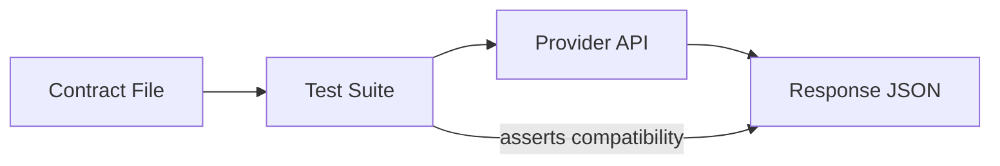

# Contract Testing Runnable Demo

This demo provides a runnable provider-side contract testing sample using Spring Boot and MockMvc.

## What You Learn

- How a provider validates JSON response against an agreed contract file
- How to protect consumer-critical fields from accidental breaking changes
- Why contract tests are faster than full end-to-end environments

## Learning Objectives

- Validate provider responses against explicit contract files.
- Protect consumer-critical fields from accidental contract breaks.
- Use fast provider-side tests as compatibility safety net.

## Theory Checkpoints

1. Contract files define externally visible API guarantees.
2. Provider tests enforce compatibility for expected response shape.
3. Non-breaking additive changes can be allowed while preserving required fields.

## Architecture (Provider-side contract flow)



## Run Steps

```bash
cd demo-contract-testing
mvn clean test
```

Optional: run app

```bash
mvn spring-boot:run
```

## Verification Steps

```bash
mvn -q clean test
```

Check that both `ProviderContractTest` and `ContractCompatibilityTest` pass.

## Key Files

- `src/test/resources/contracts/product-by-id-response.json`
- `src/test/java/com/masterclass/contract/ProviderContractTest.java`
- `src/test/java/com/masterclass/contract/ContractCompatibilityTest.java`

## Expected Outcome

- Contract JSON and provider response remain compatible.
- Required consumer fields are present across endpoint responses.
- Test suite fails quickly if provider breaks the agreed contract.

## Hands-on Lab

1. Add a new optional field in provider response and verify tests still pass.
2. Rename a required field and observe contract test failure.
3. Add a second contract for another endpoint and create matching test.
