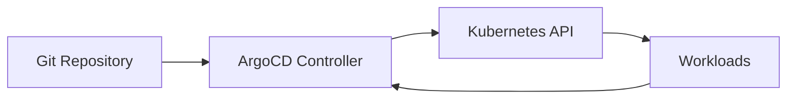

# GitOps with ArgoCD Demo

This demo shows how to run declarative deployments where Git is the source of truth and ArgoCD continuously reconciles cluster state.

## Learning Objectives

- Understand desired state vs actual state reconciliation
- Configure ArgoCD auto-sync and self-healing
- Validate Git commit driven rollout behavior

## Architecture



## Theory Checkpoints

1. Desired state lives in Git, not in ad-hoc cluster edits.
2. ArgoCD detects drift and can self-heal with `prune` and `selfHeal`.
3. Deployment changes should happen by pull request and commit history.

## Project Structure

```text
demo-gitops-argocd/
  argocd/
    application.yaml
  k8s/
    namespace.yaml
    deployment.yaml
    service.yaml
```

## Run Steps

```bash
kubectl apply -f k8s/namespace.yaml
kubectl apply -f k8s/deployment.yaml
kubectl apply -f k8s/service.yaml
kubectl apply -f argocd/application.yaml
```

## Verification Steps

```bash
kubectl get applications -n argocd
kubectl get pods -n gitops-demo
kubectl get svc -n gitops-demo
```

Change image tag in `k8s/deployment.yaml`, commit, and push. ArgoCD should sync automatically.

## Expected Outcome

- ArgoCD application reaches `Synced` and `Healthy`
- Pods reflect the image tag declared in Git
- Manual cluster drift is reconciled back to Git-defined state

## Hands-on Lab

1. Disable auto-sync and trigger manual sync from ArgoCD UI.
2. Delete one pod and verify self-healing recreates it.
3. Add a second app path and manage both via one ArgoCD project.
