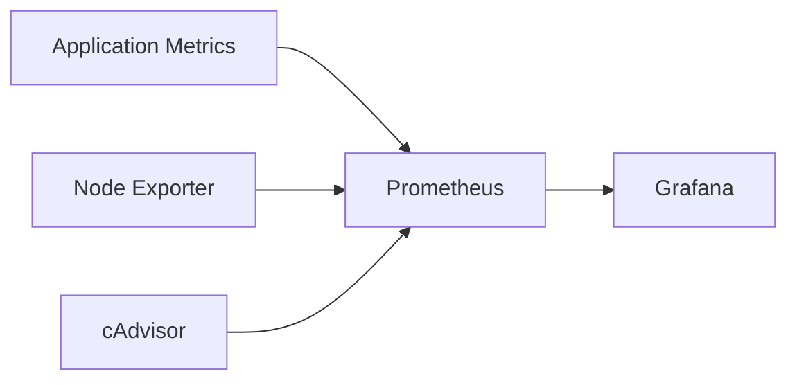

# Production Monitoring Demo

This demo provides a baseline monitoring stack using Prometheus + Grafana with node and container metrics.

## Learning Objectives

- Collect metrics from infrastructure and containers
- Query time-series data in Prometheus
- Visualize operational signals in Grafana

## Architecture



## Theory Checkpoints

1. Prometheus scrapes targets on interval and stores time-series data.
2. Grafana reads Prometheus as a datasource for dashboards.
3. SRE golden signals can be derived from traffic, errors, latency, and saturation.

## Project Structure

```text
demo-production-monitoring/
  docker-compose.yml
  prometheus/
    prometheus.yml
  grafana/
    provisioning/
      datasources/
        datasource.yml
```

## Run Steps

```bash
docker compose up -d
```

## Verification Steps

```bash
docker compose ps
curl http://localhost:9090/-/healthy
curl http://localhost:3000/api/health
```

Open:
- Prometheus: http://localhost:9090
- Grafana: http://localhost:3000 (admin/admin)

## Expected Outcome

- Prometheus discovers configured scrape targets
- Grafana auto-connects to Prometheus datasource
- Metrics are queryable and dashboard-ready

## Hands-on Lab

1. Add application metrics endpoint and include it in scrape targets.
2. Create a basic alert rule for CPU saturation.
3. Build one dashboard with request rate, error rate, and latency panels.
